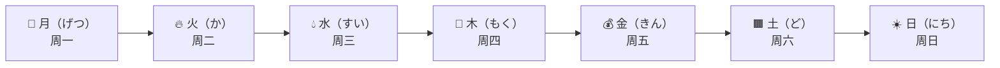

# 日期类考点

## 星期（曜日）

### 组成规律

所有星期都遵循：

```
汉字简称 + 曜日（ようび）
```

| 汉字 | 简读 | 完整写法 | 完整读法   |
| ---- | ---- | -------- | ---------- |
| 月   | げつ | 月曜日   | げつようび |
| 火   | か   | 火曜日   | かようび   |
| 水   | すい | 水曜日   | すいようび |
| 木   | もく | 木曜日   | もくようび |
| 金   | きん | 金曜日   | きんようび |
| 土   | ど   | 土曜日   | どようび   |
| 日   | にち | 日曜日   | にちようび |

问句：**何曜日（なんようび）** — 星期几？

### 快速记忆

```
月火水木金土日
げつ か すい もく きん ど にち
```

只需记住：

```
げつ
か
すい
もく
きん
ど
にち
```

然后统一加：

```
ようび
```

即可得到完整星期读法。

### 联想故事记忆法



故事：

1. 🌙 月亮出来了（周一）
2. 🔥 月亮旁边突然着火（周二）
3. 💧 用水灭火（周三）
4. 🌳 水浇灌树木（周四）
5. 💰 树上长出黄金（周五）
6. 🟫 黄金掉进土地（周六）
7. ☀️ 第二天太阳升起（周日）

## 日（にち / か）— 多少号

### 一览表

| 日期     | 写法   | 读法             |
| -------- | ------ | ---------------- |
| 1日      | 一日   | ついたち         |
| 2日      | 二日   | ふつか           |
| 3日      | 三日   | みっか           |
| 4日      | 四日   | よっか           |
| 5日      | 五日   | いつか           |
| 6日      | 六日   | むいか           |
| 7日      | 七日   | なのか           |
| 8日      | 八日   | ようか           |
| 9日      | 九日   | ここのか         |
| 10日     | 十日   | とおか           |
| 11日     | 十一日 | じゅういちにち   |
| 12日     | 十二日 | じゅうににち     |
| 13日     | 十三日 | じゅうさんにち   |
| 14日     | 十四日 | じゅうよっか     |
| 15日     | 十五日 | じゅうごにち     |
| 16日     | 十六日 | じゅうろくにち   |
| 17日     | 十七日 | じゅうしちにち   |
| 18日     | 十八日 | じゅうはちにち   |
| 19日     | 十九日 | じゅうくにち     |
| 20日     | 二十日 | はつか           |
| 21日     | 二十一日 | にじゅういちにち |
| 22日     | 二十二日 | にじゅうににち   |
| 23日     | 二十三日 | にじゅうさんにち |
| 24日     | 二十四日 | にじゅうよっか   |
| 25日     | 二十五日 | にじゅうごにち   |
| 26日     | 二十六日 | にじゅうろくにち |
| 27日     | 二十七日 | にじゅうしちにち |
| 28日     | 二十八日 | にじゅうはちにち |
| 29日     | 二十九日 | にじゅうくにち   |
| 30日     | 三十日 | さんじゅうにち   |
| 31日     | 三十一日 | さんじゅういちにち |

问句：**何日（なんにち）** — 几号？

### 规律总结

```
1～10日：不規則，逐个记忆
11～31日：数字 + にち（大多数规则）
```

- 1日 **ついたち** — 完全特殊，来自古语「月立ち（つきたち）」
- 14日 **じゅうよっか** — 由 よっか 演变，不是 じゅうよんにち
- 20日 **はつか** — 来自古语，不是 にじゅうにち
- 24日 **にじゅうよっか** — 同理，由 よっか 演变
- 其他 14+ 的日子中，带 4 的（如 24）回到 よっか 模式

### 快速记忆

真正的「钉子户」只有这 12 个，记住就行：

```
ついたち
ふつか      みっか
よっか      いつか
むいか      なのか
ようか      ここのか
とおか
じゅうよっか
はつか
にじゅうよっか
```

## 月（がつ）— 多少月

### 一览表

| 月份  | 写法     | 读法           |
| ----- | -------- | -------------- |
| 1月   | 一月     | いちがつ       |
| 2月   | 二月     | にがつ         |
| 3月   | 三月     | さんがつ       |
| 4月   | 四月     | **しがつ**     |
| 5月   | 五月     | ごがつ         |
| 6月   | 六月     | ろくがつ       |
| 7月   | 七月     | **しちがつ**   |
| 8月   | 八月     | はちがつ       |
| 9月   | 九月     | **くがつ**     |
| 10月  | 十月     | じゅうがつ     |
| 11月  | 十一月   | じゅういちがつ |
| 12月  | 十二月   | じゅうにがつ   |

### 规律总结

整体非常规则：**数字 + がつ**

**三个陷阱**（数字不是常规读法）：

| 月份 | 正确读法 | 错误读法 |
| ---- | -------- | -------- |
| 4月  | しがつ   | よんがつ |
| 7月  | しちがつ | なながつ |
| 9月  | くがつ   | きゅうがつ |

### 快速记忆

记忆口诀：**「し・しち・く」是三月天**

- 4 → し（不读 よん）
- 7 → しち（不读 なな）
- 9 → く（不读 きゅう）

## 時間（じかん）— 几点几分

### 時（じ）— 几点

| 时间   | 写法 | 读法         |
| ------ | ---- | ------------ |
| 1点    | 一時 | いちじ       |
| 2点    | 二時 | にじ         |
| 3点    | 三時 | さんじ       |
| 4点    | 四時 | **よじ**     |
| 5点    | 五時 | ごじ         |
| 6点    | 六時 | ろくじ       |
| 7点    | 七時 | **しちじ**   |
| 8点    | 八時 | はちじ       |
| 9点    | 九時 | **くじ**     |
| 10点   | 十時 | じゅうじ     |
| 11点   | 十一時 | じゅういちじ |
| 12点   | 十二時 | じゅうにじ   |

问句：**何時（なんじ）** — 几点？

#### 三个陷阱

和「月」完全一样的三个特殊数字：

| 时间 | 正确读法 | 错误读法 |
| ---- | -------- | -------- |
| 4時  | よじ     | よんじ   |
| 7時  | しちじ   | ななじ   |
| 9時  | くじ     | きゅうじ |

**7・9 月と時で統一、4 だけ注意：** 4月=しがつ、4時=よじ。月は「し」、時は「よ」で読み分ける。

### 分（ふん / ぷん）— 几分

| 分钟  | 写法 | 读法           |
| ----- | ---- | -------------- |
| 1分   | 一分 | いっぷん       |
| 2分   | 二分 | にふん         |
| 3分   | 三分 | さんぷん       |
| 4分   | 四分 | よんぷん       |
| 5分   | 五分 | ごふん         |
| 6分   | 六分 | ろっぷん       |
| 7分   | 七分 | ななふん       |
| 8分   | 八分 | はっぷん       |
| 9分   | 九分 | きゅうふん     |
| 10分  | 十分 | じゅっぷん     |

问句：**何分（なんぷん）** — 几分钟？（时刻）
问句：**何分間（なんぷんかん / なんふんかん）** — 几分钟？（时段）

#### ふん vs ぷん 规律

关键在于数字末尾音：

```
        数字末尾 → 发音变化
        
 っ（促音）→ ぷん    いっ・ろっ・はっ・じゅっ
 ん         → ぷん    さん・よん
 其他       → ふん    に・ご・なな・きゅう
```

#### 促音化规则

1、6、8、10 触发**促音化**（末尾变成小っ）：

| 数字 | 促音化 | + ぷん | 结果     |
| ---- | ------ | ------ | -------- |
| 1    | いっ   | ぷん   | いっぷん |
| 6    | ろっ   | ぷん   | ろっぷん |
| 8    | はっ   | ぷん   | はっぷん |
| 10   | じゅっ | ぷん   | じゅっぷん |

复合时同样适用（如 11分 → じゅう**いっぷん**）。

### 半（はん）— 半点

```
数字 + 時 + 半（はん）
```

| 例子   | 读法           |
| ------ | -------------- |
| 1時半  | いちじはん     |
| 3時半  | さんじはん     |
| 7時半  | しちじはん     |
| 10時半 | じゅうじはん   |

### 综合举例

| 时间      | 读法                         |
| --------- | ---------------------------- |
| 4:15     | よじ じゅうごふん            |
| 7:30     | しちじはん                   |
| 9:08     | くじ はっぷん                |
| 1:06     | いちじ ろっぷん              |
| 11:20    | じゅういちじ にじゅっぷん    |

## 相対日期（そうたいひづけ）— 相对日期词汇

### 日（ひ）— 天

```
一昨日 ─→ 昨日 ─→ 今日 ─→ 明日 ─→ 明後日
 前天      昨天     今天     明天     后天
```

| 写法       | 读法       | 含义   |
| ---------- | ---------- | ------ |
| 一昨日     | おととい   | 前天   |
| 昨日       | きのう     | 昨天   |
| 今日       | きょう     | 今天   |
| 明日       | あした     | 明天   |
| 明後日     | あさって   | 后天   |

### 週（しゅう）— 周

```
先週 ──→ 今週 ──→ 来週
上周       本周      下周
```

| 写法 | 读法         | 含义   |
| ---- | ------------ | ------ |
| 先週 | せんしゅう   | 上周   |
| 今週 | こんしゅう   | 本周   |
| 来週 | らいしゅう   | 下周   |

### 月（げつ）— 月

```
先月 ──→ 今月 ──→ 来月
上个月     这个月    下个月
```

| 写法 | 读法         | 含义     |
| ---- | ------------ | -------- |
| 先月 | せんげつ     | 上个月   |
| 今月 | こんげつ     | 这个月   |
| 来月 | らいげつ     | 下个月   |

### 年（ねん）— 年

```
一昨年 ─→ 去年 ─→ 今年 ─→ 来年 ─→ 再来年
 前年      去年     今年     明年     后年
```

| 写法     | 读法           | 含义   |
| -------- | -------------- | ------ |
| 一昨年   | おととし       | 前年   |
| 去年     | きょねん       | 去年   |
| 今年     | ことし         | 今年   |
| 来年     | らいねん       | 明年   |
| 再来年   | さらいねん     | 后年   |

### 纵向对比

关键区别在于「先」读 せん，「来」读 らい，「今」读 こん：

| 维度 | 前           | 当前           | 后             |
| ---- | ------------ | -------------- | -------------- |
| 日   | おととい     | きょう         | あした/あさって |
| 週   | せんしゅう   | こんしゅう     | らいしゅう     |
| 月   | せんげつ     | こんげつ       | らいげつ       |
| 年   | きょねん     | ことし         | らいねん       |

> 年の「前」没有用 せんねん，而是用 きょねん/おととし，这是特殊点。

### 延伸：再往前/往后

```
先々週 ──→ 先週 ──→ 今週 ──→ 来週 ──→ 再来週
上上周      上周      本周      下周      下下周
```

| 写法       | 读法             | 含义     |
| ---------- | ---------------- | -------- |
| 先々週     | せんせんしゅう   | 上上周   |
| 再来週     | さらいしゅう     | 下下周   |
| 先々月     | せんせんげつ     | 上上个月 |
| 再来月     | さらいげつ       | 下下个月 |

> 延伸规律：往前加「先」、往后加「再来/さ来」。年和前面的「一昨年/さ来年」同理。

### 毎〜（まい〜）— 每~

| 写法   | 读法           | 含义     |
| ------ | -------------- | -------- |
| 毎日   | まいにち       | 每天     |
| 毎週   | まいしゅう     | 每周     |
| 毎月   | まいつき       | 每月     |
| 毎年   | まいとし       | 每年     |
| 毎朝   | まいあさ       | 每天早上 |
| 毎晩   | まいばん       | 每天晚上 |

> 毎年 也可读 まいねん，两者都可。

### 一天内的时间段

| 写法 | 读法       | 含义                 |
| ---- | ---------- | -------------------- |
| 朝   | あさ       | 早上                 |
| 昼   | ひる       | 白天/中午            |
| 晩   | ばん       | 晚上                 |
| 夜   | よる       | 夜晚                 |
| 今朝 | けさ       | 今天早上             |
| 今晩 | こんばん   | 今天晚上             |
| 今夜 | こんや     | 今夜                 |
| 正午 | しょうご   | 中午十二点           |
| 午前零時 | ごぜんれいじ | 凌晨零点           |

### 午前 / 午後 — AM / PM

| 写法 | 读法       | 含义 |
| ---- | ---------- | ---- |
| 午前 | ごぜん     | 上午 |
| 午後 | ごご       | 下午 |

```
午前 8時  = 上午 8 点
午後 3時  = 下午 3 点
```

## 期間（きかん）— 时间段有多长

### 点 vs 段 — 必考陷阱

N5 最常见的混淆：**时刻** 和 **时段** 是不同的。

| 概念     | 问法           | 例子             |
| -------- | -------------- | ---------------- |
| 时刻     | 何時に？       | 3時 = 三点钟     |
| 时段     | 何時間？       | 3時間 = 三小时   |

```
時（じ）    = 点钟（点）      → 今 3時です（现在是三点）
時間（じかん）= 小时（段）    → 3時間勉強した（学了三小时）
```

### 〜時間（じかん）— 几个小时

规则：**数字 + じかん**，完全规则。

| 写法   | 读法           |
| ------ | -------------- |
| 1時間  | いちじかん     |
| 2時間  | にじかん       |
| 3時間  | さんじかん     |
| 4時間  | よじかん       |
| 5時間  | ごじかん       |
| 6時間  | ろくじかん     |
| 7時間  | しちじかん     |
| 8時間  | はちじかん     |
| 9時間  | くじかん       |
| 10時間 | じゅうじかん   |

问句：**何時間（なんじかん）** — 几个小时？

> 注意：4時=よじ、4時間=よじかん，都用了 よ，保持一致。7時間=しちじかん、9時間=くじかん 同理。

### 〜週間（しゅうかん）— 几周

规则：**数字 + しゅうかん**，1・8・10 有促音变化。

| 写法    | 读法             |
| ------- | ---------------- |
| 1週間   | **いっ**しゅうかん |
| 2週間   | にしゅうかん     |
| 3週間   | さんしゅうかん   |
| 4週間   | よんしゅうかん   |
| 5週間   | ごしゅうかん     |
| 6週間   | ろくしゅうかん   |
| 7週間   | ななしゅうかん   |
| 8週間   | **はっ**しゅうかん |
| 9週間   | きゅうしゅうかん |
| 10週間  | **じゅっ**しゅうかん |

### 〜ヶ月（かげつ）— 几个月

规则：**数字 + かげつ**，和「分」一样有促音变化。

| 写法      | 读法           |
| --------- | -------------- |
| 1ヶ月     | **いっ**かげつ |
| 2ヶ月     | にかげつ       |
| 3ヶ月     | さんかげつ     |
| 4ヶ月     | よんかげつ     |
| 5ヶ月     | ごかげつ       |
| 6ヶ月     | **ろっ**かげつ |
| 7ヶ月     | ななかげつ     |
| 8ヶ月     | **はっ**かげつ |
| 9ヶ月     | きゅうかげつ   |
| 10ヶ月    | **じゅっ**かげつ |

促音化规律 — 和「分」完全一致：**1・6・8・10** 变促音。

> 注意区分：3月=さんがつ（三月），3ヶ月=さんかげつ（三个月）。

问句：**何ヶ月（なんかげつ）** — 几个月？

### 〜年間（ねんかん）— 几年

规则：**数字 + ねんかん**，完全规则。

| 写法    | 读法             |
| ------- | ---------------- |
| 1年間   | いちねんかん     |
| 2年間   | にねんかん       |
| 3年間   | さんねんかん     |
| 4年間   | よねんかん       |
| 5年間   | ごねんかん       |
| 10年間  | じゅうねんかん   |

问句：**何年間（なんねんかん）** — 几年？

### 〜日間（にちかん / かかん）— 几天

**必考陷阱**：注意区分「几号」和「几天」。

| 写法      | 几号（日期）     | 几天（期间）         |
| --------- | ---------------- | -------------------- |
| 1日/1日間 | ついたち         | いちにちかん         |
| 2日/2日間 | ふつか           | ふつかかん           |
| 3日/3日間 | みっか           | みっかかん           |
| 4日/4日間 | よっか           | よっかかん           |
| 5日/5日間 | いつか           | いつかかん           |
| 6日/6日間 | むいか           | むいかかん           |
| 7日/7日間 | なのか           | なのかかん           |
| 8日/8日間 | ようか           | ようかかん           |
| 9日/9日間 | ここのか         | ここのかかん         |
| 10日/10日間 | とおか         | とおかかん           |

> 1～10日间 = 日の读法 + **かん**。1日是例外（いちにち + かん）。11日以后规则合并（じゅういちにち + かん）。

**典型考题对比：**

```
Q: 今日は 何日ですか？（今天几号？）
A: ふつかです。（二号。）

Q: 何日間 旅行しますか？（旅行几天？）
A: ふつかかん です。（两天。）
```

问句：**何日間（なんにちかん）** — 几天？

### 半年（はんとし / はんねん）

| 写法 | 读法               | 含义   |
| ---- | ------------------ | ------ |
| 半年 | はんとし/はんねん   | 半年   |

```
半年 日本に いました。
在日本待了半年。
```

## 完整的年月日读法

从左到右逐级读出：

```
2026年 6月 2日（火曜日）

にせんにじゅうろくねん
ろくがつ
ふつか（かようび）
```

规则：年→月→日→曜日，依次读即可。

## 〜ごろ — 概略时间

```
3時ごろ  = 三点左右
5時半ごろ = 五点半左右
```

**ごろ vs ぐらい：**
- ごろ — 时间点（何時、何月、何日）后
- ぐらい — 时间段后，也可用于时间点

```
3時ごろ ✓          3時間ぐらい ✓
3時ぐらい ✓（也可）3時間ごろ ✗
```

## 〜過ぎ（すぎ）& 〜前（まえ）— 过几分 / 差几分

### 〜過ぎ — 几点过几分

```
数字 + 時 + 数字 + 分過ぎ
```

| 例子          | 读法                   | 含义         |
| ------------- | ---------------------- | ------------ |
| 3時10分過ぎ   | さんじ じゅっぷんすぎ   | 三点过十分   |
| 1時5分過ぎ    | いちじ ごふんすぎ       | 一点过五分   |
| 10時半過ぎ    | じゅうじはんすぎ       | 十点半过     |

### 〜前 — 差几分到几点

```
数字 + 時 + 数字 + 分前
```

| 例子          | 读法                   | 含义         |
| ------------- | ---------------------- | ------------ |
| 3時10分前     | さんじ じゅっぷんまえ   | 差十分三点   |
| 5時5分前      | ごじ ごふんまえ         | 差五分五点   |

> 3時10分前 = 2時50分。做题时注意换算。

## 時間助詞「に」— 时间 + に

### 基本规则

| 时间类型       | 加 に？ | 例子                     |
| -------------- | ------- | ------------------------ |
| 具体时间点     | ✅ 加   | 3時**に**、6月**に**     |
| 星期（曜日）   | 🔺 可选 | 日曜日**に** / 日曜日    |
| 相对日期       | ❌ 不加 | きょう✗に、あした✗に     |
| 频率词         | ❌ 不加 | 毎日✗に、毎週✗に         |

### 详细对照

```
✅ 加 に（具体时间点）
   3時に 行きます         三点去
   6月に 日本へ 来ました   六月来了日本
   2026年に 卒業します     2026年毕业
   日曜日に 会いましょう   周日见吧

❌ 不加 に（相对/模糊时间）
   きょう 行きます         今天去（✗ きょうに）
   あした 休みます         明天休息（✗ あしたに）
   毎日 勉強します         每天学习（✗ 毎日に）
   先週 会いました         上周见了（✗ 先週に）
```

### 记忆口诀

> **数字明确就加 に，模糊概念不加 に**

## 頻度副詞（ひんどふくし）— 频率副词

### 从高到低排列

```
いつも  ＞  たいてい  ＞  よく  ＞  ときどき  ＞  あまり～ない  ＞  ぜんぜん～ない
 总是        通常         经常        有时           不太              完全不
(100%)     (~80%)       (~60%)      (~30%)        (~10%)             (0%)
```

| 副词             | 含义     | 注意                   |
| ---------------- | -------- | ---------------------- |
| いつも           | 总是     |                        |
| たいてい         | 大抵/通常 |                       |
| よく             | 经常     |                        |
| ときどき         | 有时     |                        |
| あまり〜ない     | 不太     | **必须搭配否定**       |
| ぜんぜん〜ない   | 完全不   | **必须搭配否定**       |

### 位置

放在动词前面：

```
わたしは 毎日 たいてい 7時に 起きます。
我每天通常七点起床。

ときどき 図書館で 勉強します。
有时在图书馆学习。

あまり テレビを 見ません。
不太看电视。

ぜんぜん 日本語が わかりません。
完全不懂日语。
```

## 〜から〜まで — 从〜到〜

### 时间范围

```
9時から 5時まで 働きます。
从九点工作到五点。

月曜日から 金曜日まで 学校へ 行きます。
从周一到周五去学校。

1月から 3月まで 日本に いました。
从一月到三月在日本。
```

### 地点范围（延伸用法）

```
東京から 大阪まで 2時間半 かかります。
从东京到大阪要两个半小时。
```

### から・まで 可单独使用

```
9時から 始まります。    从九点开始。
5時まで 終わりません。  到五点才结束。
```
